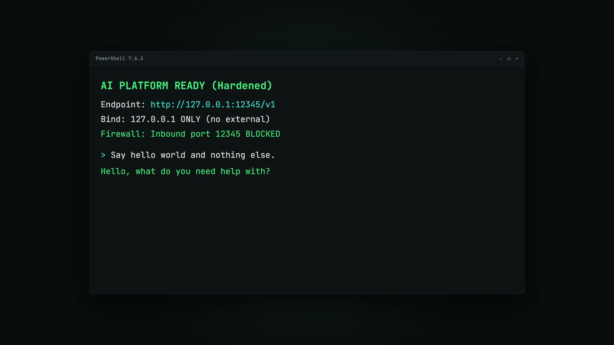
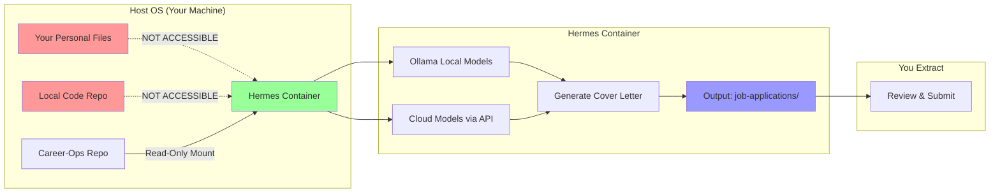
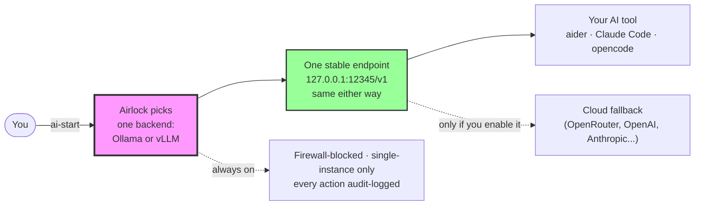
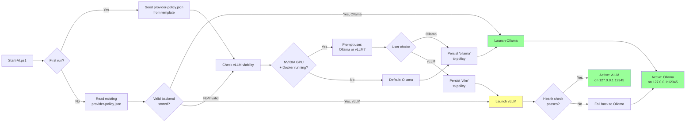
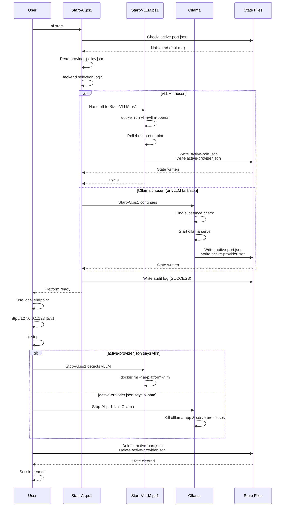
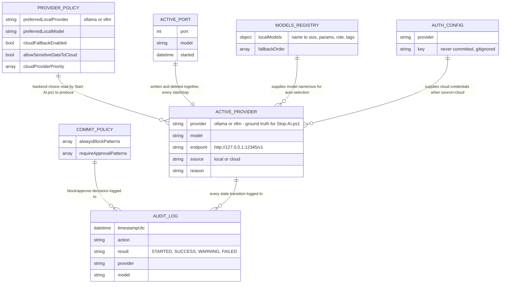
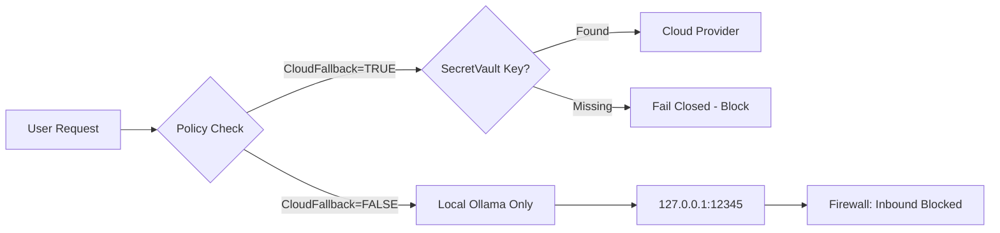
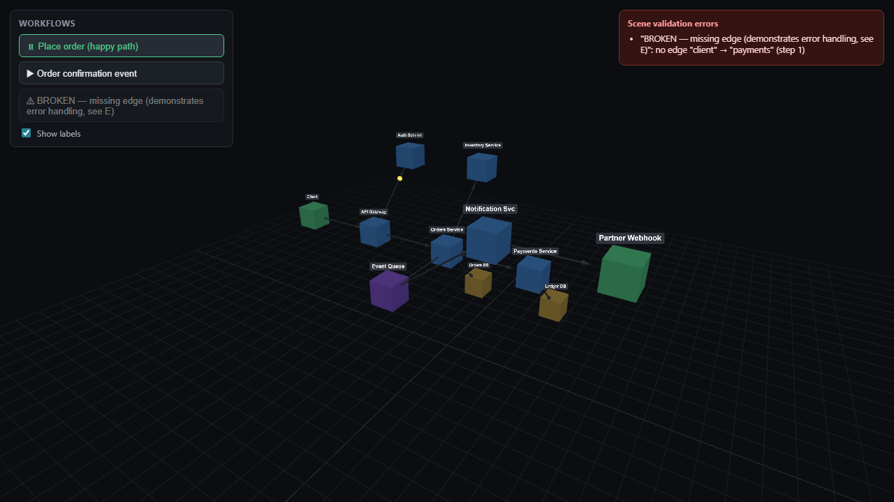

# Airlock

**A hardened, single-instance AI infrastructure for Windows with Ollama, PowerShell, and optional cloud fallback.**

One door open at a time — exactly one local model backend running, walled off from the outside, everything logged.

[](LICENSE)
[](https://github.com/PowerShell/PowerShell)
[](https://ollama.ai)

---

## 🎥 Demo

[](https://github.com/veeresh-bikkaneti/airlock/raw/main/brag-output/brag.mp4)

Click the image to play/download the demo (GitHub doesn't play video inline in README files — this opens it in your browser's video player).

---

## 🎯 The Problem We Solve

### Before This Platform

| Issue | Impact |
|-------|--------|
| **Multiple Ollama instances** running on different ports (11434, 12345, etc.) | Tools fail, models load multiple times into VRAM, confusion |
| **No single source of truth** for which port/model is active | Manual environment variable juggling, session state lost |
| **External exposure risk** — Ollama binds to `0.0.0.0` by default | Unintended network access to your local LLM |
| **No audit trail** for AI-assisted development | Cannot trace which model generated which code |
| **Cloud fallback is opaque** — no policy enforcement | Accidental data leakage to external providers |
| **Resource conflicts** — models fail to load due to memory pressure | Wasted time debugging "out of VRAM" errors |

### After This Platform

✅ **Single-instance enforcement** — only one Ollama process, always on port 12345  
✅ **Automatic firewall guard** — inbound traffic blocked by default  
✅ **Structured audit logging** — every API call logged with model/provider metadata  
✅ **Resource monitoring** — RAM/VRAM checks before model load  
✅ **Policy-driven cloud fallback** — explicit approval required, secrets never in code  
✅ **Unified CLI** — `ai-start`, `ai-stop`, `ai-health`, `ai-code`  

---

## 📦 Component Guide

**What each part does and why it's here:**

### 🔧 Core Scripts (`scripts/`)

| File | Purpose | Why It Exists |
|------|---------|---------------|
| **`Start-AI.ps1`** | Starts Ollama on port 12345, enforces single instance, creates firewall rules | Prevents the "multiple Ollama instances" problem that breaks tools and wastes VRAM |
| **`Start-VLLM.ps1`** | Runs vLLM (Docker) as the local backend on port 12345, health-checked and firewall-guarded like Ollama | Optional higher-throughput backend for NVIDIA GPU owners — called automatically by `Start-AI.ps1` when `preferredLocalProvider` is `vllm` |
| **`Get-BackendCapability.ps1`** | Detects whether vLLM is viable (NVIDIA GPU + Docker Desktop running) | Lets `Start-AI.ps1` only offer vLLM as a choice when it can actually work |
| **`Stop-AI.ps1`** | Kills all Ollama processes, clears session state, optionally removes firewall rules | Clean shutdown without leaving zombie processes or orphaned ports |
| **`profile-helpers.ps1`** | Provides `ai-start`, `ai-stop`, `ai-health`, `ai-code` CLI commands | Single source of truth for environment variables; no manual `export` commands |
| **`Invoke-CommitReview.ps1`** | Pre-commit hook that scans for secrets, API keys, PII | Prevents accidental data leakage to Git (the "don't commit your .env" problem) |

### ⚙️ Configuration (`config/`)

| File | Purpose | Why It Exists |
|------|---------|---------------|
| **`models.json`** | Registry of local models (sizes, capabilities, fallback order) | Tools know which model to use for coding vs. reasoning vs. fast tasks |
| **`provider-policy.json`** | Routing rules (local-first, cloud fallback, data privacy) | Explicit control over when/whether data leaves your machine |
| **`auth.json.template`** | Template for cloud provider API keys | Separates secrets from code; run `ai-auth-set <provider> <key>` to fill it in — never commit the real `auth.json` |
| **`opencode.json.template`** | Template for opencode.ai agent configuration | Pre-configures agents to use local Ollama endpoint |
| **`hermes-config.json.template`** | Template for the Hermes container's agent config | Configures Hermes's cloud-model settings before first run |
| **`jcode-config.toml.template`** | Template for the jcode agent configuration | Pre-configures jcode to use the local Ollama endpoint |
| **`pi-models.json.template`** | Template for Pi.dev's model registry | Mirrors `models.json` for the Pi.dev agent |

### 🛡️ Policies (`config/policies/`)

| File | Purpose | Why It Exists |
|------|---------|---------------|
| **`provider-policy.json`** | Defines local vs. cloud routing, data privacy rules | Ensures sensitive code never goes to cloud unless explicitly allowed |
| **`commit-policy.json`** | Patterns to block in commits (API keys, passwords, PII) | Automated security gate before `git commit` |

### 📚 Documentation (`docs/`)

| File | Purpose |
|------|---------|
| **`00-Artifact-Index.md`** | Complete manifest of all files and their purposes |
| **`01-Local-AI-Platform-Blueprint.md`** | High-level architecture and design decisions |
| **`02-Windows-Implementation-Guide.md`** | Windows-specific setup and troubleshooting |
| **`03-PowerShell-Module-Spec.md`** | API reference for `ai-*` commands |
| **`04-Security-Audit-Runbook.md`** | How to audit logs, rotate keys, respond to incidents |
| **`05-Provider-Fallback-Matrix.md`** | Decision matrix for when to use local vs. cloud |
| **`06-Model-Acquisition-Backlog.md`** | Zero-touch model auto-selection/pull backlog and review history |
| **`07-Quickstart-Playbook.md`** | Step-by-step operational playbook (start, switch models, troubleshoot) |
| **`adr/`** | Architecture Decision Records — the "why" behind major choices (model acquisition placement, Ollama auto-install, vLLM backend option) |

#### Configuring Agent CLIs

The platform exposes one OpenAI-compatible **Chat Completions** endpoint at `http://127.0.0.1:12345/v1` (`ollama` as a dummy API key, real model names from `ai-models`). Any tool that speaks Chat Completions can point straight at it — verified below against the real installed CLIs, not just their docs. Codex CLI and Claude Code cannot; both speak a different, incompatible protocol (details in their entries below).

**Pi.dev** — copy `config/pi-models.json.template` to `%USERPROFILE%\.pi\agent\models.json` and confirm its `ollama.baseUrl` matches the platform's port (default `12345`; edit both if you change `ai-start -Port`).

**opencode.ai** — copy `config/opencode.json.template` to `~/.config/opencode/opencode.json` for a global config, or to `opencode.json` in a project root for a project-scoped one. It already points `provider.ollama.options.baseURL` at `http://127.0.0.1:12345/v1` and sets `model` to `ollama/devstral-small-2:24b`. Run `opencode` from anywhere and it picks it up.

**jcode** — no template file; the `--no-api-key`/`--auth` flags this section used to document don't exist in current jcode (verified against a real install, jcode v0.65.0). The real command:
  ```powershell
  jcode provider add local-ollama --base-url "http://127.0.0.1:12345/v1" `
    --model "qwen2.5-coder:7b" --provider ollama `
    --set-default --model-catalog --overwrite
  ```
  `--provider ollama` is jcode's built-in provider type — it already knows Ollama needs no API key, so nothing else to pass. jcode has no per-project config — this writes into `%USERPROFILE%\.jcode\config.toml`.

**Codex CLI (OpenAI's) — does not work against this platform, confirmed by direct testing.** Codex's `wire_api` only supports `"responses"` — `wire_api = "chat"` is hard-rejected by the CLI itself ("no longer supported"). Pointed a custom `model_providers` entry at a logging stub and inspected the actual request: Codex POSTs to `{base_url}/responses` using OpenAI's newer Responses API shape, not Chat Completions. Ollama's OpenAI-compatible layer (checked against the current Ollama docs) only implements `/v1/chat/completions`, `/v1/completions`, `/v1/models`, and `/v1/embeddings` — no `/v1/responses`. There's no config that bridges this; it's the same class of problem as Claude Code below, just a different protocol pairing. Codex's own `--oss --local-provider ollama` flag exists but targets Ollama's default port `11434`, not this platform's `12345`, and wouldn't fix the protocol mismatch anyway. If a future Codex or Ollama release adds the missing side, that'll unblock it — not before.

**aider** — no config file needed; `ai-code` (in `profile-helpers.ps1`) already launches it with `--openai-api-base` pointed at the platform.

> **Claude Code cannot be pointed at this platform.** Claude Code (the `claude` CLI) only speaks Anthropic's Messages API (`/v1/messages`) — never the OpenAI-compatible Chat Completions shape this platform's `/v1/chat/completions` endpoint exposes, and Anthropic's own docs are explicit that they "[don't] support routing Claude Code to non-Claude models through any gateway." Setting `ANTHROPIC_BASE_URL` to `127.0.0.1:12345` in `settings.json`'s `env` block will not work — you'll get exactly the base-url/auth-token error this used to promise it'd fix (the repo previously shipped a `claude-settings.json.template` that invented a settings.json schema that was never real; it's been removed). If you want Claude Code itself, authenticate it normally with a real Anthropic API key or `claude login` — it's a separate, cloud-only tool from the local backend this platform manages. This platform's own cloud-fallback path (`ai-auth-set anthropic <key>` + `cloudFallbackEnabled: true` in `provider-policy.json`) talks to Anthropic's real API directly and is unaffected by this limitation.

### 🧩 VS Code Extension (`src/extension.ts`)

Thin wrapper over the `ai-*` PowerShell helpers — status bar model indicator plus commands to start, stop, health-check, and switch models without leaving the editor. See [`EXTENSION.md`](EXTENSION.md) for setup and command list.

### 🤖 Hermes Agent (`hermes-container/`)

**What is Hermes?**

Hermes is a **sandboxed AI agent** for career operations (job applications, resume optimization, LinkedIn outreach) that runs in a Docker container.

**Why does it exist?**

| Problem | Hermes Solution |
|---------|-----------------|
| You want AI to help with job hunting, but you don't want your **personal files** (tax docs, family photos) exposed to the AI | Hermes runs in an isolated container that **only sees your career-ops repository**, not your Desktop/Documents |
| You need to use **cloud models** (GPT-4, Claude) for career tasks, but your **local code** must stay private | Hermes uses cloud models for career work; your local code stays on your machine |
| You want to **automate** job applications without running scripts on your main OS | Hermes is a Docker container with **dropped capabilities**, no network access to your LAN, and read-only mounts |

**How it works:**



**Usage:**

```powershell
# 1. Prepare your career-ops repo (separate from your code)
git clone git@github.com:yourusername/career-ops.git
cd career-ops

# 2. Add your resume, job descriptions, templates
# (This repo is the ONLY thing Hermes can see)

# 3. Start Hermes
cd ../airlock/hermes-container
.\run-hermes.ps1

# 4. Hermes generates job applications in output/
# 5. Review and submit manually
.\stop-hermes.ps1
```

**Security guarantees:**

- ✅ **Cannot access** your Desktop, Documents, Downloads
- ✅ **Cannot access** your local code repositories
- ✅ **Cannot access** your LAN (other containers, printers, NAS)
- ✅ **Cannot modify** your host filesystem (output is a Docker volume you extract)
- ✅ **All capabilities dropped** (no root, no network, no new privileges)

---

## 🏗️ Architecture

The big picture — the diagrams below this one cover backend selection, startup/shutdown, and the data model each in detail, so this one stays deliberately simple:



**How to read the diagram below this point:** "Backend Selection Flowchart" is *how* Airlock picks Ollama vs. vLLM (the `P` box above, expanded). "Start/Stop State Lifecycle" is *what happens* when you run `ai-start`/`ai-stop`, in order. "Data Model" is the JSON files on disk and what each one holds. You don't need all three to use Airlock — they're here for when something doesn't match what you expected.

### Backend Selection Flowchart



### Start/Stop State Lifecycle



### Data Model (State & Config Entities)

What each JSON file on disk actually holds, and how they relate. `provider-policy.json` is the persisted *intent* ("use vLLM if I can"); `active-provider.json` is the *live truth* of what's running right now — they're deliberately separate so a stale runtime state can never look like a changed user preference.



---

## 🚀 Quick Start

### Prerequisites

- Windows 11
- [PowerShell 7+](https://github.com/PowerShell/PowerShell)
- [Ollama](https://ollama.ai) (installed, but **not running**)
- [Python 3.11+](https://www.python.org/) (for aider)
- [Git](https://git-scm.com/)

### Installation (1-line)

```powershell
irm https://raw.githubusercontent.com/veeresh-bikkaneti/airlock/main/install.ps1 | iex
```

This clones the repo to `~/.airlock-src` and runs `setup.ps1`, which copies scripts/config to `~/.ai-platform` and wires `profile-helpers.ps1` into your PowerShell profile. Restart PowerShell (or run `. $PROFILE`) afterward so the `ai-*` commands are available.

Like any `irm | iex` one-liner (rustup, Scoop, oh-my-posh use the same pattern), this runs code before you've read it — that's the convenience trade-off. If you'd rather review first, clone and inspect, then run `setup.ps1` yourself:

```powershell
git clone https://github.com/veeresh-bikkaneti/airlock.git
cd airlock
.\setup.ps1
```

`ollama pull <model>` isn't a required manual step either way — `ai-start` auto-detects your hardware and pulls the best-fitting model in the background the first time you run it (see [`06-Model-Acquisition-Backlog.md`](docs/06-Model-Acquisition-Backlog.md)). Pull one yourself first only if you want a specific model pinned via `ai-start -Model <name>`.

<details>
<summary>Fully manual install (no setup.ps1)</summary>

```powershell
New-Item -Path "$env:USERPROFILE\.ai-platform\scripts" -ItemType Directory -Force
New-Item -Path "$env:USERPROFILE\.ai-platform\config\policies" -ItemType Directory -Force
Copy-Item .\scripts\*.ps1 "$env:USERPROFILE\.ai-platform\scripts\" -Force
Copy-Item .\config\*.json "$env:USERPROFILE\.ai-platform\config\" -Force
Copy-Item .\config\policies\*.json "$env:USERPROFILE\.ai-platform\config\policies\" -Force
Copy-Item .\config\*.template "$env:USERPROFILE\.ai-platform\config\" -Force
Add-Content $PROFILE ". `"$env:USERPROFILE\.ai-platform\scripts\profile-helpers.ps1`""
```

</details>

### First Run

```powershell
# Start the platform (single-instance, hardened)
ai-start

# Expected output:
# ========================================
#   AI PLATFORM READY (Hardened)
#   Endpoint: http://127.0.0.1:12345/v1
#   Model   : devstral-small-2:24b
#   Bind    : 127.0.0.1 ONLY (no external)
#   Firewall: Inbound port 12345 BLOCKED
# ========================================
# Note: the Firewall line is conditional on admin privileges. Running as admin,
# you'll see "Inbound port 12345 BLOCKED" (shown above). Without admin, you'll
# see "NO RULE on port 12345 (defense-in-depth only — listener is loopback-only,
# not externally reachable either way)" instead — the rule just didn't get created,
# but nothing outside your machine could reach the port regardless.

# Check health
ai-health

# Start coding with aider
ai-code
```

---

## 📚 Commands Reference

| Command | Description |
|---------|-------------|
| `ai-start [-Model <name>] [-Force]` | Start Ollama on port 12345, kill any rogues |
| `ai-stop [-CleanFirewall]` | Stop all Ollama processes, clear state |
| `ai-health` | Full health check (processes, API, firewall, resources) |
| `ai-port` | Show active port and model |
| `ai-provider` | Show active provider (local/cloud) |
| `ai-switch <model>` | Switch model mid-session (e.g., `ai-switch qwen3-coder:30b`) |
| `ai-code` | Launch aider with active provider |
| `ai-audit-last` | Show recent audit log entries |
| `ai-config` | Show full platform configuration |
| `ai-models` | List configured models and capabilities |
| `ai-policy` | Show provider routing policy |
| `ai-auth-set <provider> <key>` | Store API key for cloud fallback |
| `ai-hermes-start` | Launch containerized Hermes agent |
| `ai-hermes-stop` | Stop Hermes and extract output |
| `ai-memory-start` | Start memory service (FastAPI, Chroma vector DB, LangGraph) |
| `ai-memory-stop` | Stop memory service |
| `ai-memory-status` | Show memory service status (process, API health, firewall, routing) |
| `ai-memory-on` | Route clients through memory service (retrieve → inject → forward) |
| `ai-memory-off` | Revert clients to direct backend calls (disable memory routing) |

---

## 🔐 Security Model

### Default: Local Only, Fail Closed



### Security Features

1. **Single-instance enforcement** — prevents resource conflicts
2. **Firewall guard** — blocks inbound traffic to Ollama port
3. **Secret isolation** — API keys stored via `ai-auth-set` in `~/.ai-platform/config/auth.json`, gitignored, never in code
4. **Audit logging** — every request logged with timestamp, user, model, provider
5. **Fail-closed policy** — missing secrets = no cloud fallback
6. **Model digest verification** — ensures model integrity

---

## 🌐 Local + Cloud Hybrid

### Configuration

Edit `config/policies/provider-policy.json`:

```json
{
  "cloudFallbackEnabled": false,
  "allowSensitiveDataToCloud": false,
  "preferredLocalModel": "devstral-small-2:24b",
  "localFallbackModels": ["qwen3-coder:30b", "qwen2.5-coder:7b"],
  "cloudProviderPriority": ["openrouter", "openai", "anthropic"],
  "defaultCloudModels": {
    "openrouter": "openai/gpt-4.1-mini",
    "openai": "gpt-4.1-mini",
    "anthropic": "claude-3-5-sonnet-latest"
  }
}
```

### Enable Cloud Fallback (Optional)

```powershell
# 1. Set policy to allow cloud
# Edit: config/policies/provider-policy.json
# Set: "cloudFallbackEnabled": true

# 2. Store API key securely
ai-auth-set openrouter sk-or-v1-your-key-here

# 3. Start platform
ai-start

# Now if local model fails, it will fall back to cloud (with audit)
```

---

## 📊 Architecture Files

```
airlock/
├── README.md                     # This file
├── PLAYBOOK.md                   # Step-by-step operational playbook
├── LICENSE                       # MIT License
├── install.ps1                   # 1-line remote installer (irm ... | iex): clones + runs setup.ps1
├── setup.ps1                     # Local installer (deploys to ~/.ai-platform)
├── Start-AI.bat / Stop-AI.bat    # Double-click wrappers around the .ps1 scripts
├── main.py                       # Demo script for testing the OpenAI-compatible endpoint
├── requirements.txt              # Python dependencies for main.py
├── package.json / tsconfig.json  # VS Code extension build config
├── src/
│   └── extension.ts              # VS Code extension: status bar, start/stop/switch commands
├── scripts/
│   ├── Start-AI.ps1              # Main startup (hardened, single-instance, backend chooser)
│   ├── Start-VLLM.ps1            # Optional vLLM backend (Docker, NVIDIA GPU)
│   ├── Get-BackendCapability.ps1 # Detects vLLM viability (GPU + Docker)
│   ├── Get-ModelAcquisition.ps1  # Hardware detection + auto model pull (Ollama/HF)
│   ├── Stop-AI.ps1               # Clean shutdown (whichever backend is active)
│   ├── Start-MemoryService.ps1   # Starts memory service (FastAPI, Chroma, LangGraph)
│   ├── Stop-MemoryService.ps1    # Stops memory service
│   ├── profile-helpers.ps1       # CLI helpers (ai-start, ai-code, ai-health, ai-memory-*, etc.)
│   ├── Invoke-CommitReview.ps1   # Pre-commit security gate
│   └── Test-*.ps1                # Self-checks for model selection / capability logic
├── config/
│   ├── models.json               # Model registry (capabilities, sizes)
│   ├── policies/
│   │   ├── provider-policy.json  # Routing rules (local/cloud, preferredLocalProvider)
│   │   └── commit-policy.json    # Patterns blocked/needing approval before commit
│   └── *.template                # Copy-and-fill templates: auth, opencode,
│                                  # hermes-config, jcode-config, pi-models
├── docs/
│   ├── 00-Artifact-Index.md
│   ├── 01-Local-AI-Platform-Blueprint.md
│   ├── 02-Windows-Implementation-Guide.md
│   ├── 03-PowerShell-Module-Spec.md
│   ├── 04-Security-Audit-Runbook.md
│   ├── 05-Provider-Fallback-Matrix.md
│   ├── 06-Model-Acquisition-Backlog.md
│   ├── 07-Quickstart-Playbook.md
│   ├── COMPONENTS.md
│   └── adr/                      # Architecture Decision Records
├── hermes-container/             # Sandboxed agent for job applications
│   ├── README.md
│   ├── PLAYBOOK.md
│   ├── Dockerfile
│   ├── docker-compose.yml
│   ├── run-hermes.ps1
│   └── stop-hermes.ps1
├── memory-service/                # FastAPI app: vector DB + RAG + LangGraph session memory
│   ├── app/
│   │   ├── main.py                # FastAPI routes: /health, /v1/memory/*, /v1/chat/completions proxy
│   │   ├── memory_store.py        # Chroma vector DB (remember/recall)
│   │   ├── graph.py                # LangGraph retrieve -> inject -> forward pipeline
│   │   ├── checkpointer.py        # Per-session short-term/working memory
│   │   ├── embeddings.py          # Ollama /api/embeddings client
│   │   ├── proxy.py                # Forwards to the real backend, tracks active provider
│   │   ├── audit.py                # Structured audit logging
│   │   └── config.py
│   ├── tests/
│   └── requirements.txt
└── tools/
    └── 3d-system-visualizer/      # Standalone Three.js system-design + workflow visualizer
        └── index.html
```

---

## 🧊 3D System Visualizer

Standalone, single-file Three.js scene (`tools/3d-system-visualizer/index.html`) for visualizing a system's services, data stores, and edges as a 3D node graph — with animated workflow playback (a packet travels the actual call path, step by step) and built-in scene validation (catches edges referencing missing nodes or steps with no matching edge, reported per flow).

No build step, no dependencies to install — it pulls Three.js from a CDN via an import map.



**Run it locally:**

```powershell
# from repo root
python -m http.server 8347 --directory tools/3d-system-visualizer
# or
npx serve tools/3d-system-visualizer
```

Open `http://localhost:8347` and click a workflow button in the top-left panel to watch it animate through the graph.

> Import maps require a real HTTP origin — opening `index.html` directly via `file://` will fail to load the ES modules.

**Load your own scene:** the "Scene" panel picks between scenes listed in `tools/3d-system-visualizer/scenes/manifest.json`, accepts `?scene=scenes/your-file.json` on the URL, or a local file via "Load file…" — any scene using the same `{nodes, edges, flows}` schema as `scenes/ecommerce-demo.json` works. A bad or malformed scene shows an error instead of clearing the one currently on screen.

**Inspect a node or edge:** click any box or connector to open a panel with its metadata — nodes can carry `description`, `owner`, and `status` (`healthy`/`degraded`/`down`); edges can carry `protocol` and `latencyMs`. A `degraded` or `down` node also glows amber or red in the scene itself, so problems read at a glance without clicking anything.

---

## 🧪 Testing

### Verify Installation

```powershell
# 1. Check health
ai-health

# Expected: All green (2 processes, API healthy, firewall blocked, RAM >20%)

# 2. Test model switch
ai-switch qwen3-coder:30b
ai-switch deepseek-r1:14b

# 3. Check audit logs
ai-audit-last

# 4. Test cloud fallback (if enabled)
# Temporarily stop Ollama
ai-stop
# Try ai-code — should fail or fall back to cloud (depending on policy)
```

### Stress Test Single-Instance Enforcement

```powershell
# Start multiple times — should detect and reuse existing
ai-start
ai-start
ai-start

# Should see: "Found Ollama on port 12345" each time (no duplicates)

# Force restart
ai-start -Force

# Should see: "Force: killing for clean restart"
```

---

## 🛠️ Troubleshooting

### "Multiple instances detected"

```powershell
# Clean kill and restart
ai-stop
ai-start -Force
```

### "Firewall rule could not be created"

Run PowerShell as **Administrator**:

```powershell
New-NetFirewallRule -DisplayName "AI-Platform-Ollama-Block-12345" `
    -Direction Inbound -Action Block -Protocol TCP -LocalPort 12345
```

### "Model not found locally"

```powershell
# Pull the model
ollama pull devstral-small-2:24b

# Or switch to available model
ai-switch qwen2.5-coder:7b
```

### "Low VRAM / OOM errors"

```powershell
# Use smaller model
ai-switch qwen2.5-coder:7b

# Or check available memory
ai-health
```

---

## 🤝 Contributing

1. Fork the repo
2. Create a feature branch (`git checkout -b feature/amazing`)
3. Commit your changes (`git commit -m 'Add amazing feature'`)
4. Push to the branch (`git push origin feature/amazing`)
5. Open a Pull Request

### Development Guidelines

- Always test with `ai-start -Force` before committing
- Ensure no secrets in code (use `config/auth.json.template` etc. for examples — never commit the filled-in versions)
- Add audit logging for new actions
- Update `docs/` for significant changes

---

## 📄 License

MIT License — see [LICENSE](LICENSE)

---

## 🙏 Acknowledgments

- [Ollama](https://ollama.ai) for local LLM inference
- [aider](https://aider.chat) for AI-assisted coding
- [opencode.ai](https://opencode.ai) for agent orchestration
- [PowerShell](https://microsoft.com/powershell) for cross-platform scripting

---

**Built with ❤️ for secure, local-first AI development.**