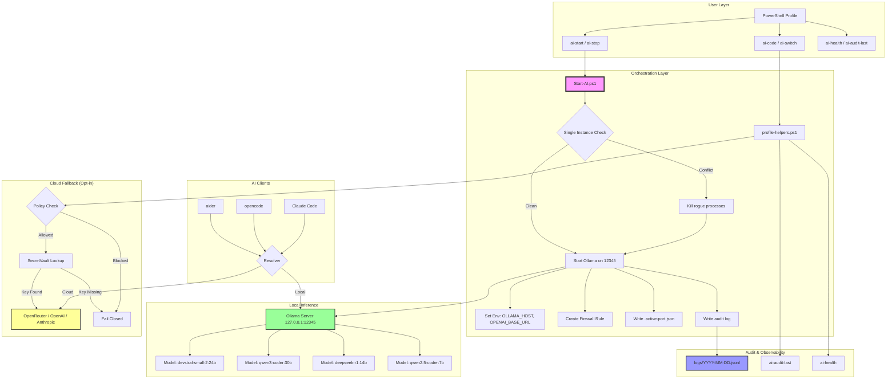
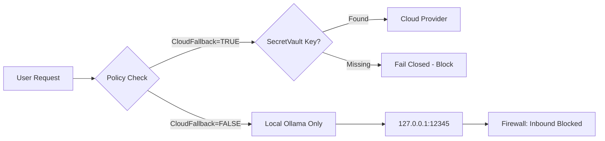

# Local AI Platform

**A hardened, single-instance AI infrastructure for Windows with Ollama, PowerShell, and optional cloud fallback.**

[](LICENSE)
[](https://github.com/PowerShell/PowerShell)
[](https://ollama.ai)

---

## 🎯 The Problem We Solve

### Before This Platform

| Issue | Impact |
|-------|--------|
| **Multiple Ollama instances** running on different ports (11434, 12345, etc.) | Tools fail, models load multiple times into VRAM, confusion |
| **No single source of truth** for which port/model is active | Manual environment variable juggling, session state lost |
| **External exposure risk** — Ollama binds to `0.0.0.0` by default | Unintended network access to your local LLM |
| **No audit trail** for AI-assisted development | Cannot trace which model generated which code |
| **Cloud fallback is opaque** — no policy enforcement | Accidental data leakage to external providers |
| **Resource conflicts** — models fail to load due to memory pressure | Wasted time debugging "out of VRAM" errors |

### After This Platform

✅ **Single-instance enforcement** — only one Ollama process, always on port 12345  
✅ **Automatic firewall guard** — inbound traffic blocked by default  
✅ **Structured audit logging** — every API call logged with model/provider metadata  
✅ **Resource monitoring** — RAM/VRAM checks before model load  
✅ **Policy-driven cloud fallback** — explicit approval required, secrets never in code  
✅ **Unified CLI** — `ai-start`, `ai-stop`, `ai-health`, `ai-code`  

---

## 📦 Component Guide

**What each part does and why it's here:**

### 🔧 Core Scripts (`scripts/`)

| File | Purpose | Why It Exists |
|------|---------|---------------|
| **`Start-AI.ps1`** | Starts Ollama on port 12345, enforces single instance, creates firewall rules | Prevents the "multiple Ollama instances" problem that breaks tools and wastes VRAM |
| **`Start-VLLM.ps1`** | Runs vLLM (Docker) as the local backend on port 12345, health-checked and firewall-guarded like Ollama | Optional higher-throughput backend for NVIDIA GPU owners — called automatically by `Start-AI.ps1` when `preferredLocalProvider` is `vllm` |
| **`Get-BackendCapability.ps1`** | Detects whether vLLM is viable (NVIDIA GPU + Docker Desktop running) | Lets `Start-AI.ps1` only offer vLLM as a choice when it can actually work |
| **`Stop-AI.ps1`** | Kills all Ollama processes, clears session state, optionally removes firewall rules | Clean shutdown without leaving zombie processes or orphaned ports |
| **`profile-helpers.ps1`** | Provides `ai-start`, `ai-stop`, `ai-health`, `ai-code` CLI commands | Single source of truth for environment variables; no manual `export` commands |
| **`Invoke-CommitReview.ps1`** | Pre-commit hook that scans for secrets, API keys, PII | Prevents accidental data leakage to Git (the "don't commit your .env" problem) |

### ⚙️ Configuration (`config/`)

| File | Purpose | Why It Exists |
|------|---------|---------------|
| **`models.json`** | Registry of local models (sizes, capabilities, fallback order) | Tools know which model to use for coding vs. reasoning vs. fast tasks |
| **`provider-policy.json`** | Routing rules (local-first, cloud fallback, data privacy) | Explicit control over when/whether data leaves your machine |
| **`.env.template`** | Template for environment variables (API keys, endpoints) | Shows what's needed without exposing real secrets |
| **`auth.json.template`** | Template for cloud provider API keys | Separates secrets from code; keys stored in PowerShell vault, not Git |
| **`opencode.json.template`** | Template for opencode.ai agent configuration | Pre-configures agents to use local Ollama endpoint |
| **`.aider.conf.yml.template`** | Template for aider (AI coding tool) configuration | Pre-configures aider to use Ollama backend |

### 🛡️ Policies (`config/policies/`)

| File | Purpose | Why It Exists |
|------|---------|---------------|
| **`provider-policy.json`** | Defines local vs. cloud routing, data privacy rules | Ensures sensitive code never goes to cloud unless explicitly allowed |
| **`commit-policy.json`** | Patterns to block in commits (API keys, passwords, PII) | Automated security gate before `git commit` |

### 📚 Documentation (`docs/`)

| File | Purpose |
|------|---------|
| **`00-Artifact-Index.md`** | Complete manifest of all files and their purposes |
| **`01-Local-AI-Platform-Blueprint.md`** | High-level architecture and design decisions |
| **`02-Windows-Implementation-Guide.md`** | Windows-specific setup and troubleshooting |
| **`03-PowerShell-Module-Spec.md`** | API reference for `ai-*` commands |
| **`04-Security-Audit-Runbook.md`** | How to audit logs, rotate keys, respond to incidents |
| **`05-Provider-Fallback-Matrix.md`** | Decision matrix for when to use local vs. cloud |

#### Pi.dev Agent Configuration
- Ensure the Pi.dev agent baseUrl points to the same port used by the platform (default **12345**). Update `C:\Users\veere\.pi\agent\models.json` if you change the platform port.

### 🧩 VS Code Extension (`src/extension.ts`)

Thin wrapper over the `ai-*` PowerShell helpers — status bar model indicator plus commands to start, stop, health-check, and switch models without leaving the editor. See [`EXTENSION.md`](EXTENSION.md) for setup and command list.

### 🤖 Hermes Agent (`hermes-container/`)

**What is Hermes?**

Hermes is a **sandboxed AI agent** for career operations (job applications, resume optimization, LinkedIn outreach) that runs in a Docker container.

**Why does it exist?**

| Problem | Hermes Solution |
|---------|-----------------|
| You want AI to help with job hunting, but you don't want your **personal files** (tax docs, family photos) exposed to the AI | Hermes runs in an isolated container that **only sees your career-ops repository**, not your Desktop/Documents |
| You need to use **cloud models** (GPT-4, Claude) for career tasks, but your **local code** must stay private | Hermes uses cloud models for career work; your local code stays on your machine |
| You want to **automate** job applications without running scripts on your main OS | Hermes is a Docker container with **dropped capabilities**, no network access to your LAN, and read-only mounts |

**How it works:**

```mermaid
flowchart LR
    subgraph "Host OS (Your Machine)"
        A[Your Personal Files] -.NOT ACCESSIBLE.> B[Hermes Container]
        C[Local Code Repo] -.NOT ACCESSIBLE.> B
        D[Career-Ops Repo] -->|Read-Only Mount| B
    end

    subgraph "Hermes Container"
        B --> E[Ollama Local Models]
        B --> F[Cloud Models via API]
        E --> G[Generate Cover Letter]
        F --> G
        G --> H[Output: job-applications/]
    end

    subgraph "You Extract"
        H --> I[Review & Submit]
    end

    style A fill:#f99
    style C fill:#f99
    style B fill:#9f9
    style H fill:#99f
```

**Usage:**

```powershell
# 1. Prepare your career-ops repo (separate from your code)
git clone git@github.com:yourusername/career-ops.git
cd career-ops

# 2. Add your resume, job descriptions, templates
# (This repo is the ONLY thing Hermes can see)

# 3. Start Hermes
cd ../local-ai-platform/hermes-container
.\run-hermes.ps1

# 4. Hermes generates job applications in output/
# 5. Review and submit manually
.\stop-hermes.ps1
```

**Security guarantees:**

- ✅ **Cannot access** your Desktop, Documents, Downloads
- ✅ **Cannot access** your local code repositories
- ✅ **Cannot access** your LAN (other containers, printers, NAS)
- ✅ **Cannot modify** your host filesystem (output is a Docker volume you extract)
- ✅ **All capabilities dropped** (no root, no network, no new privileges)

---

## 🏗️ Architecture



---

## 🚀 Quick Start

### Prerequisites

- Windows 11
- [PowerShell 7+](https://github.com/PowerShell/PowerShell)
- [Ollama](https://ollama.ai) (installed, but **not running**)
- [Python 3.11+](https://www.python.org/) (for aider)
- [Git](https://git-scm.com/)

### Installation

```powershell
# 1. Clone or download this repo
git clone https://github.com/YOUR_USERNAME/local-ai-platform.git
cd local-ai-platform

# 2. Deploy to your home directory
New-Item -Path "$env:USERPROFILE\.ai-platform\scripts" -ItemType Directory -Force
Copy-Item .\scripts\* "$env:USERPROFILE\.ai-platform\scripts\" -Force
Copy-Item .\config\* "$env:USERPROFILE\.ai-platform\config\" -Force -Recurse

# 3. Pull your preferred model(s)
ollama pull devstral-small-2:24b
ollama pull qwen3-coder:30b

# 4. Add to your PowerShell profile (~\Documents\WindowsPowerShell\Microsoft.PowerShell_profile.ps1)
Add-Content $PROFILE ". `"$env:USERPROFILE\.ai-platform\scripts\profile-helpers.ps1`""

# 5. Restart PowerShell
```

### First Run

```powershell
# Start the platform (single-instance, hardened)
ai-start

# Expected output:
# ========================================
#   AI PLATFORM READY (Hardened)
#   Endpoint: http://127.0.0.1:12345/v1
#   Model   : devstral-small-2:24b
#   Bind    : 127.0.0.1 ONLY (no external)
#   Firewall: Inbound port 12345 BLOCKED
# ========================================

# Check health
ai-health

# Start coding with aider
ai-code
```

---

## 📚 Commands Reference

| Command | Description |
|---------|-------------|
| `ai-start [-Model <name>] [-Force]` | Start Ollama on port 12345, kill any rogues |
| `ai-stop [-CleanFirewall]` | Stop all Ollama processes, clear state |
| `ai-health` | Full health check (processes, API, firewall, resources) |
| `ai-port` | Show active port and model |
| `ai-provider` | Show active provider (local/cloud) |
| `ai-switch <model>` | Switch model mid-session (e.g., `ai-switch qwen3-coder:30b`) |
| `ai-code` | Launch aider with active provider |
| `ai-audit-last` | Show recent audit log entries |
| `ai-config` | Show full platform configuration |
| `ai-models` | List configured models and capabilities |
| `ai-policy` | Show provider routing policy |
| `ai-auth-set <provider> <key>` | Store API key for cloud fallback |
| `ai-hermes-start` | Launch containerized Hermes agent |
| `ai-hermes-stop` | Stop Hermes and extract output |

---

## 🔐 Security Model

### Default: Local Only, Fail Closed



### Security Features

1. **Single-instance enforcement** — prevents resource conflicts
2. **Firewall guard** — blocks inbound traffic to Ollama port
3. **Secret isolation** — API keys in PowerShell SecretVault, never in code
4. **Audit logging** — every request logged with timestamp, user, model, provider
5. **Fail-closed policy** — missing secrets = no cloud fallback
6. **Model digest verification** — ensures model integrity

---

## 🌐 Local + Cloud Hybrid

### Configuration

Edit `config/policies/provider-policy.json`:

```json
{
  "cloudFallbackEnabled": false,
  "allowSensitiveDataToCloud": false,
  "preferredLocalModel": "devstral-small-2:24b",
  "localFallbackModels": ["qwen3-coder:30b", "qwen2.5-coder:7b"],
  "cloudProviderPriority": ["openrouter", "openai", "anthropic"],
  "defaultCloudModels": {
    "openrouter": "openai/gpt-4.1-mini",
    "openai": "gpt-4.1-mini",
    "anthropic": "claude-3-5-sonnet-latest"
  }
}
```

### Enable Cloud Fallback (Optional)

```powershell
# 1. Set policy to allow cloud
# Edit: config/policies/provider-policy.json
# Set: "cloudFallbackEnabled": true

# 2. Store API key securely
ai-auth-set openrouter sk-or-v1-your-key-here

# 3. Start platform
ai-start

# Now if local model fails, it will fall back to cloud (with audit)
```

---

## 📊 Architecture Files

```
local-ai-platform/
├── README.md                 # This file
├── LICENSE                   # MIT License
├── main.py                   # Demo script for testing
├── requirements.txt          # Python dependencies
├── scripts/
│   ├── Start-AI.ps1          # Main startup (hardened, single-instance)
│   ├── Stop-AI.ps1           # Clean shutdown
│   ├── profile-helpers.ps1   # CLI helpers (ai-start, ai-code, etc.)
│   └── Invoke-CommitReview.ps1  # Pre-commit security gate
├── config/
│   ├── models.json           # Model registry (capabilities, sizes)
│   ├── provider-policy.json  # Routing rules (local/cloud)
│   ├── .env.template         # Environment template
│   ├── .aider.conf.yml.template  # Aider config template
│   ├── opencode.json.template    # opencode.ai config
│   └── auth.json.template    # Cloud provider auth template
├── docs/
│   ├── 00-Artifact-Index.md
│   ├── 01-Local-AI-Platform-Blueprint.md
│   ├── 02-Windows-Implementation-Guide.md
│   ├── 03-PowerShell-Module-Spec.md
│   ├── 04-Security-Audit-Runbook.md
│   └── 05-Provider-Fallback-Matrix.md
└── hermes-container/         # Sandboxed agent for job applications
    ├── README.md
    ├── PLAYBOOK.md
    ├── Dockerfile
    ├── docker-compose.yml
    ├── run-hermes.ps1
    └── stop-hermes.ps1
```

---

## 🧪 Testing

### Verify Installation

```powershell
# 1. Check health
ai-health

# Expected: All green (2 processes, API healthy, firewall blocked, RAM >20%)

# 2. Test model switch
ai-switch qwen3-coder:30b
ai-switch deepseek-r1:14b

# 3. Check audit logs
ai-audit-last

# 4. Test cloud fallback (if enabled)
# Temporarily stop Ollama
ai-stop
# Try ai-code — should fail or fall back to cloud (depending on policy)
```

### Stress Test Single-Instance Enforcement

```powershell
# Start multiple times — should detect and reuse existing
ai-start
ai-start
ai-start

# Should see: "Found Ollama on port 12345" each time (no duplicates)

# Force restart
ai-start -Force

# Should see: "Force: killing for clean restart"
```

---

## 🛠️ Troubleshooting

### "Multiple instances detected"

```powershell
# Clean kill and restart
ai-stop
ai-start -Force
```

### "Firewall rule could not be created"

Run PowerShell as **Administrator**:

```powershell
New-NetFirewallRule -DisplayName "AI-Platform-Ollama-Block-12345" `
    -Direction Inbound -Action Block -Protocol TCP -LocalPort 12345
```

### "Model not found locally"

```powershell
# Pull the model
ollama pull devstral-small-2:24b

# Or switch to available model
ai-switch qwen2.5-coder:7b
```

### "Low VRAM / OOM errors"

```powershell
# Use smaller model
ai-switch qwen2.5-coder:7b

# Or check available memory
ai-health
```

---

## 🤝 Contributing

1. Fork the repo
2. Create a feature branch (`git checkout -b feature/amazing`)
3. Commit your changes (`git commit -m 'Add amazing feature'`)
4. Push to the branch (`git push origin feature/amazing`)
5. Open a Pull Request

### Development Guidelines

- Always test with `ai-start -Force` before committing
- Ensure no secrets in code (use `.env.template` for examples)
- Add audit logging for new actions
- Update `docs/` for significant changes

---

## 📄 License

MIT License — see [LICENSE](LICENSE)

---

## 🙏 Acknowledgments

- [Ollama](https://ollama.ai) for local LLM inference
- [aider](https://aider.chat) for AI-assisted coding
- [opencode.ai](https://opencode.ai) for agent orchestration
- [PowerShell](https://microsoft.com/powershell) for cross-platform scripting

---

**Built with ❤️ for secure, local-first AI development.**