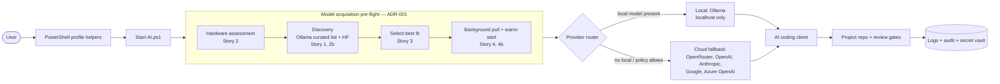

# Airlock Blueprint

## Objective
Build a Windows 11 AI workspace that prefers local execution through Ollama, exposes a stable OpenAI-compatible endpoint for tools, preserves auditability, and falls back to cloud providers only when a valid API key is present and policy allows it.

## Core Requirements
- PowerShell 7 (`pwsh`) is mandatory.
- Local model hosting is the primary path.
- Cloud use is disabled by default.
- Multiple cloud providers are supported behind a common provider selection layer.
- Logging, approvals, and secret hygiene are first-class design requirements.

## Architecture

Story 5 (verbose logging) is not a stage above — it's the audit trail (`Write-AuditLog`) running through every box, including inside the background pull job.

Model acquisition guarantees the "Local: Ollama" branch has a model to route to; it does not change routing itself. See [`adr/ADR-001-model-acquisition-placement.md`](adr/ADR-001-model-acquisition-placement.md) for why it's placed here instead of as a separate service or a Provider Router extension.

## Trust Model
### Local path
- Default execution target.
- Binds to loopback (`127.0.0.1`) only.
- No external provider traffic required.
- Best option for sensitive source code and private data.

### Cloud fallback path
- Allowed only if all of the following are true:
  1. The user explicitly enables cloud mode.
  2. A provider API key exists in a secure vault.
  3. The requested task is allowed by policy.
  4. The system logs the provider, model, and reason for fallback.

## Provider Strategy
### Local providers
- Ollama via OpenAI-compatible local endpoint.

### Cloud providers
- OpenRouter.
- OpenAI.
- Anthropic.
- Google AI / Gemini.
- Azure OpenAI.

## Routing Rules
1. Try the preferred local model first.
2. If the local model is unavailable, select a configured local fallback model.
3. If no local model is available and cloud fallback is disabled, stop with a clear error.
4. If cloud fallback is enabled and a valid key exists, select the highest-priority cloud provider from policy.
5. Log the routing decision before the model session starts.

## Security Controls
- Loopback-only binding for local inference.
- Provider credentials stored via `ai-auth-set` in `~/.ai-platform/config/auth.json`, gitignored, never committed. (`ai-start` also checks for a registered PowerShell SecretManagement vault named `AIVault`, but that check is informational only — nothing currently reads keys from it.)
- No secrets in scripts, git config, or terminal history.
- Manual review before commit.
- URL autodetection disabled where possible.
- Separate infrastructure secrets from resume, career, or other personal data.

## Logging Model
Each significant action should produce:
- UTC timestamp.
- Username.
- Hostname.
- Action name.
- Result (`STARTED`, `SUCCESS`, `WARNING`, `FAILED`).
- Provider.
- Model.
- Port or endpoint.
- Short message.

### Example log entry
```json
{
  "timestampUtc": "2026-06-25T13:00:00Z",
  "user": "alice",
  "host": "WORKSTATION01",
  "action": "Select-Provider",
  "result": "SUCCESS",
  "provider": "ollama",
  "model": "devstral-small-2:24b",
  "endpoint": "http://127.0.0.1:12345/v1",
  "message": "Local provider selected by policy"
}
```

## Audit Objectives
- Prove whether the session used local or cloud inference.
- Prove that the user approved sensitive operations.
- Prove that secrets were loaded from vault rather than plain files.
- Make failures diagnosable without leaking credentials.

## Recommended Repository Layout
```text
%USERPROFILE%\.ai-platform\
  scripts\
  logs\
  state\
  policies\
  .active-provider.json
  .active-port.json
```

## Operational Notes
- Keep provider selection separate from tool launch logic.
- Use a single source of truth for active provider state.
- Prefer structured JSON logs over plain text when possible.
- Fail closed: if policy or secret lookup fails, do not silently switch to cloud.
