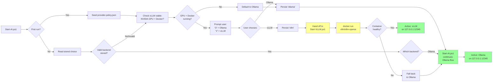

# Provider Fallback Matrix

## Decision Table

| Scenario | Local available | Cloud fallback enabled | Secret available | Result |
|---|---:|---:|---:|---|
| Normal operation | Yes | No | N/A | Use local provider (Ollama or vLLM, per `preferredLocalProvider`). |
| Local down, strict policy | No | No | Yes/No | Stop with clear error; do not use cloud. |
| Local down, cloud allowed, OpenRouter key exists | No | Yes | Yes | Use OpenRouter and log fallback reason. |
| Local down, OpenRouter missing, OpenAI key exists | No | Yes | Yes | Use OpenAI if it is next in priority order. |
| Local down, no provider keys available | No | Yes | No | Stop with error; fallback cannot proceed. |
| Local up, cloud keys present | Yes | Yes | Yes | Still use local by default unless user explicitly overrides policy. |

## Provider Mapping

| Provider | Key name | Endpoint | Notes |
|---|---|---|---|
| Ollama | none; use placeholder `ollama` for OpenAI-compatible clients | `http://127.0.0.1:<port>/v1` | Primary local path. |
| vLLM | none; use placeholder `ollama` for OpenAI-compatible clients | `http://127.0.0.1:<port>/v1` | Optional alt local path — requires NVIDIA GPU + Docker Desktop. Chosen via `preferredLocalProvider: "vllm"` in provider-policy.json. |
| OpenRouter | `OPENROUTER_API_KEY` | `https://openrouter.ai/api/v1` | Good multi-model broker option. |
| OpenAI | `OPENAI_API_KEY` | `https://api.openai.com/v1` | Common fallback for OpenAI-compatible tooling. |
| Anthropic | `ANTHROPIC_API_KEY` | `https://api.anthropic.com` | May need provider-specific client settings. |
| Google | `GOOGLE_API_KEY` | `https://generativelanguage.googleapis.com` | Use adapter or provider-aware client when needed. |
| Azure OpenAI | `AZURE_OPENAI_KEY`, `AZURE_OPENAI_URL` | tenant-specific Azure endpoint | Requires deployment-specific configuration. |
| NVIDIA NIM | `NIM_API_KEY` | `https://integrate.api.nvidia.com/v1` | PLACEHOLDER — not configured. Confirm key name and priority before enabling. |
| Together AI | `TOGETHER_API_KEY` | `https://api.together.xyz/v1` | PLACEHOLDER — not configured. |
| Groq | `GROQ_API_KEY` | `https://api.groq.com/openai/v1` | PLACEHOLDER — not configured. |
| Mistral | `MISTRAL_API_KEY` | `https://api.mistral.ai/v1` | PLACEHOLDER — not configured. |
| Cohere | `COHERE_API_KEY` | `https://api.cohere.ai/v1` | PLACEHOLDER — not configured. |

## Recommended Priority
1. Ollama local.
2. OpenRouter.
3. OpenAI.
4. Anthropic.
5. Google.
6. Azure OpenAI.

Placeholder providers (NVIDIA NIM, Together AI, Groq, Mistral, Cohere) are documented but not in the priority order or fallback logic yet — pending key availability and a priority decision.

## Model Acquisition Fallback
This governs how a *model* is discovered/acquired, distinct from the provider fallback above (which governs where a *chat completion request* goes).

1. Ollama curated list (`config/models.json` `fallbackOrder`) — checked first; this is the source of truth for pullable models since Ollama has no public "list all pullable models" API.
2. Hugging Face GGUF search (`huggingface.co/api/models`) — used only when Ollama has no suitable match; secondary source, discovery only.

## Rationale
- Local preserves privacy and reduces accidental data exposure.
- A broker such as OpenRouter can simplify multi-model fallback.
- Direct providers remain available when a broker is not desired.
- Azure OpenAI is often enterprise-specific and should remain explicitly configured.

---

## Local Backend Selection (Ollama vs vLLM)

When you run `ai-start`, the platform decides which backend to use:

### Key points:

- **On first run:** If you have an NVIDIA GPU and Docker Desktop is running, you'll be prompted once to choose Ollama or vLLM.
- **On subsequent runs:** Your choice is stored in `provider-policy.json` under `preferredLocalProvider` — no prompt appears.
- **vLLM requirements:** NVIDIA GPU (checked via `nvidia-smi`) AND Docker Desktop running. If either is missing, you won't be offered the vLLM choice.
- **Fallback:** If you choose vLLM but it fails to start (health check timeout after 120s), the platform automatically falls back to starting Ollama instead.
- **Same endpoint:** Both backends expose `http://127.0.0.1:12345/v1` (OpenAI-compatible API), so downstream tools (`aider`, `opencode`, `ai-code`) need zero changes.

### When to use each:

| Backend | Best for | Requirements |
|---------|----------|--------------|
| **Ollama** | General use, works everywhere, broad model support | Windows 11, Ollama installed |
| **vLLM** | Batch/concurrent inference, token throughput optimization | NVIDIA GPU, Docker Desktop + WSL2, NVIDIA Container Toolkit |

When in doubt, choose Ollama — it's the safe default and works on any Windows machine.
